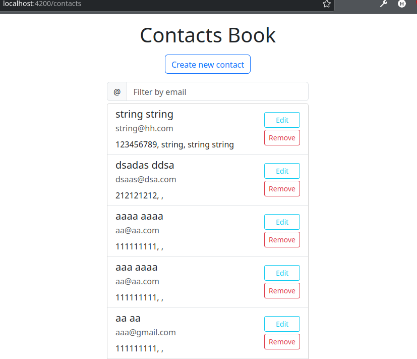
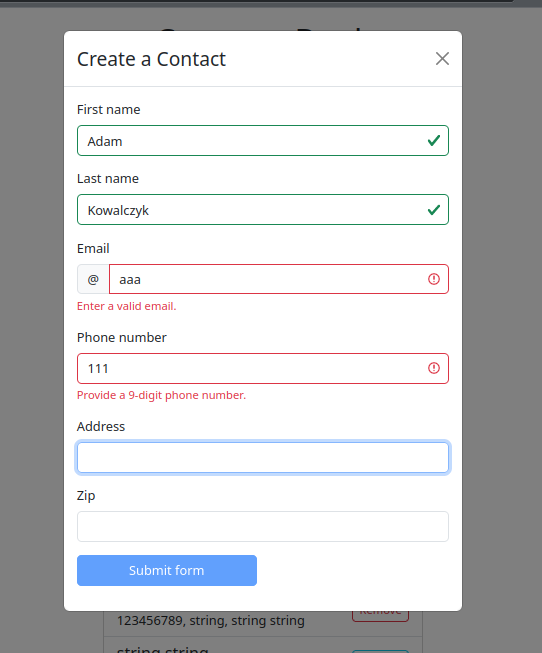
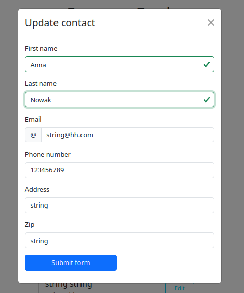
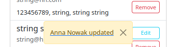
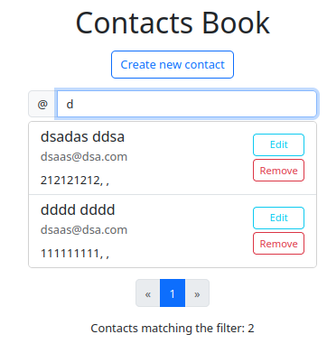

# Contacts Book


Main view


Creating a contact


Updating a contact


Success alert


Filtering by email


Spinner while loading data

## Validation

There's frontend and backend validation. Only first name, last name, email, and phone numbers are validated.

## Technologies and frameworks
- Angular 16
- .NET 6
- Bootstrap
- MS SQL Express

## Database

Database: ContactsBook

Backup: `database.sql` file in this repository

User: abcde
Password: AfD*943!

 

## Running

Backend:
```
cd ContactsBookApplication.Backend/ContactsBookApplication.Backend

dotnet run
```

Frontend:
```
cd frontend
ng serve -o
```