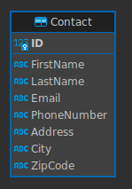

# Contacts Book

Site deployed at https://contactsbookapp.azurewebsites.net/contacts

May be slow to load since it's on a low cost tier.

## Validation

There's both frontend and backend validation. Only first name, last name, email, phone numbers, and zip-code are validated.

## Technologies and frameworks
- Angular 16
- .NET 6
- Bootstrap 5
- MS SQL Express
- Azure

## Development database

Database: ContactsBook

Backup: `database.sql` file in this repository

User: abcde
Password: AfD*943!

 

## Running

### Backend
```
cd ContactsBookApplication.Backend/ContactsBookApplication.Backend
dotnet run
```

### Frontend
```
cd frontend
ng serve -o
```